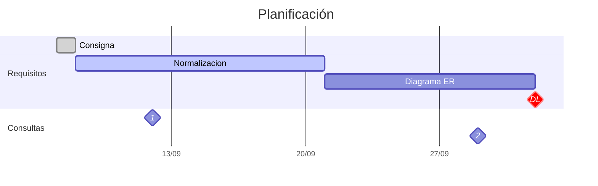
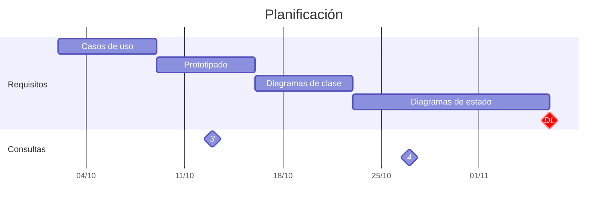

<h1 align="center">TUP - Metodología de sistemas - 2023</h1>

### Primer sprint:

**Deadline**: 02/10/2023
**Requisitos**: DER, normalización

### Segundo sprint:

**Deadline**: 02/10/2023
**Requisitos**: Casos de uso, prototipado, diagramas de clase, diagramas de estado

